# Installing KVM on Ubuntu 20.04, 22.04, or 24.04

Notes on how to install KVM on Ubuntu 20.04, 22.04, or 24.04

## Intro to KVM - **WHY** 🤔

Kernel-based Virtual Machine (KVM) is a virtualization solution for Linux on x86 hardware.  Using KVM, you can run multiple virtual machines where each virtual machine has private virtualized hardware: a network card, disk, graphics adapter, etc.

This guide provides a step-by-step walkthrough of installing and configuring KVM on a fresh Ubuntu Desktop installation.

- [Installing KVM on Ubuntu 20.04, 22.04, or 24.04](#installing-kvm-on-ubuntu-2004-2204-or-2404)
  - [Pre-Req's](#pre-reqs)
    - [Install Ubuntu 20.04, 22.04, or 24.04](#install-ubuntu-2004-2204-or-2404)
    - [Update Ubuntu](#update-ubuntu)
    - [Optional, enable SSH](#optional-enable-ssh)
    - [Optional, install byobu](#optional-install-byobu)
    - [Install CPU-Checker package and check for KVM feature](#install-cpu-checker-package-and-check-for-kvm-feature)
  - [Install Tooling for KVM Management](#install-tooling-for-kvm-management)
  - [Check that virt-manager was installed and can talk to your libvirt daemon](#check-that-virt-manager-was-installed-and-can-talk-to-your-libvirt-daemon)
  - [Setup a network bridge to enable communication between the host and your VMS](#setup-a-network-bridge-to-enable-communication-between-the-host-and-your-vms)
    - [Determine the Name of your Ethernet Adapter](#determine-the-name-of-your-ethernet-adapter)
    - [Backup existing netplan configuration file](#backup-existing-netplan-configuration-file)
    - [Edit Netplan config](#edit-netplan-config)
    - [Verify netplan config file](#verify-netplan-config-file)
  - [Setup Bridge Network on KVM](#setup-bridge-network-on-kvm)
  - [Use Virtual Machine Manager to check Network Bridge](#use-virtual-machine-manager-to-check-network-bridge)
  - [Use Virtual Machine Manager to Create a VM](#use-virtual-machine-manager-to-create-a-vm)
  - [Conclusion and Next Steps](#conclusion-and-next-steps)
  - [Troubleshooting](#troubleshooting)

<details>
<summary>TL;DR 😎</summary>

No time to read? For experienced users, the commands to get KVM up and running:

```bash
# Update and install necessary packages
sudo apt update && sudo apt dist-upgrade -y
sudo apt install -y qemu-kvm bridge-utils virt-manager cpu-checker

# Check for KVM acceleration
sudo kvm-ok

# Get network interface name
ip -c link

# Create bridge configuration (replace eno1 with your interface)
cat <<EOF | sudo tee /etc/netplan/01-network-manager-all.yaml
network:
  version: 2
  renderer: networkd
  ethernets:
    eno1:
      dhcp4: no
      dhcp6: no
  bridges:
    breno1:
      dhcp4: yes
      dhcp6: no
      interfaces: [ eno1 ]
EOF

# Apply network configuration
sudo netplan try
sudo netplan apply

# Create KVM network bridge
cat <<-EOF > hostbridge.xml
<network>
  <name>hostbridge</name>
  <forward mode='bridge'/>
  <bridge name='breno1'/>
</network>
EOF

sudo virsh net-define hostbridge.xml && \
sudo virsh net-autostart hostbridge && \
sudo virsh net-start hostbridge
```

</details>

## Pre-Req's

### Install Ubuntu 20.04, 22.04, or 24.04

Install Ubuntu 20.04, 22.04, or 24.04, we will use Desktop version for this guide.
During install choose "Normal installation",
"Download updates while installing Ubuntu", and
"Install third-party software for graphics and Wi-Fi
hardware and additional media formats" to make sure we have all the necessary drivers.  

This takes about 15 minutes, but depends on your Computer and Network Speed.

### Update Ubuntu

Once Ubuntu Install has completed, it will ask you to restart.  
Follow the prompts and then login to the fresh install.  

Open a terminal and update your packages to the latest version, this step may take
a while. Follow the prompts from the command line tooling.  

```shell
sudo apt update && sudo apt dist-upgrade -y
```

### Optional, enable SSH

You don't **need** SSH access to the machine, but it makes it easier to administer it remotely.

Install OpenSSH, follow the prompts if it asks for information:

```shell
sudo apt install openssh-server -y
```

Once Openssh is installed, you can get your IP with:

```shell
ip a | grep inet
```

look for the line that says something like:

```shell
inet 192.168.X.Y
```

where X and Y are dependent on your network setup.  
The 192.168. part could also be different,
but it is usually 192.168.X.Y for smaller networks.

You can then ssh to your machine with:

```shell
ssh <username>@192.168.X.Y
```

you will be presented with something like:

```shell
The authenticity of host '192.168.X.Y (192.168.X.Y)' can't be established.
ECDSA key fingerprint is SHA256:SOME_SHA_KEY_GOES_HERE.
Are you sure you want to continue connecting (yes/no/[fingerprint])? yes
```

type `yes` and it should ask you for your password.  

The intricacies of SSH and SSH keys are beyond the scope of this guide.  

### Optional, install byobu

When remotely administering a machine, it is helpful to have a shell
always running that you can re-connect to.
Byobu enables you to do just that, learn more at [byobu.org](https://www.byobu.org/)

it can be installed with:

```shell
sudo apt install -y byobu
```

### Install CPU-Checker package and check for KVM feature

Now that our machine is up to date, we can Install cpu-checker package:

```shell
sudo apt install -y cpu-checker && sudo kvm-ok
```

If everything is setup properly, you should get something like:

```shell
daniel@kvmdemo:~$ sudo kvm-ok
INFO: /dev/kvm exists
KVM acceleration can be used
```

> [!NOTE]
> In the example above, my user name is `daniel` and my machine name is `kvmdemo`

The important bit is that it responded with:

```shell
KVM acceleration can be used
```

If you don't see that message, you may need to edit your BIOS settings.
Unfortunately, each device is a little different in how you change that setting.

## Install Tooling for KVM Management

Since we know that the current machine supports KVM, we can now install
some tooling to make our life easier.

```shell
sudo apt install -y qemu-kvm bridge-utils virt-manager
```

The above command installs the following, and supporting tooling:

- `qemu-kvm`: provides machine emulation, learn more at [qemu.org](https://www.qemu.org/)

- `bridge-utils`: tools to enable your host machine to network with the VMs
  
- `virt-manager`: a simple UI for creating VMs
  
Follow the prompts, a few packages will be installed to support using
qemu, bridge-utils and virt-manager.  

> **reboot** the host machine. There are many ways to make sure everything
> is setup and started properly, but the easiest way is to just reboot the machine.  

## Check that virt-manager was installed and can talk to your libvirt daemon

On the host machine, open your application view and look for "Virtual Machine Manager"

## Setup a network bridge to enable communication between the host and your VMS

In order to communicate between your host machine and the hosted VMs,
you need to create a bridge.

### Determine the Name of your Ethernet Adapter

In order to setup a bridge, we need to figure out which ethernet adapter
to use, for this we can use the `ip` command:

```shell
ip -c link
```

Here the `-c` will provide you with a nice colorized output and the `link` will show you network device status

the output should look similar to this:

```shell
daniel@kvmdemo:~$ ip -c link
1: lo: <LOOPBACK,UP,LOWER_UP> mtu 65536 qdisc noqueue state UNKNOWN mode DEFAULT group default qlen 1000
    link/loopback 00:00:00:00:00:00 brd 00:00:00:00:00:00
2: eno1: <BROADCAST,MULTICAST,UP,LOWER_UP> mtu 1500 qdisc fq_codel master breno1 state UP mode DEFAULT group default qlen 1000
    link/ether <SOME ADDRESS HERE> brd ff:ff:ff:ff:ff:ff
```

in the above example, the ethernet adapter of interest is `eno1`.

### Backup existing netplan configuration file

In case we need to get back to a default install

```shell
sudo cp /etc/netplan/01-network-manager-all.yaml /etc/netplan/01-network-manager-all.yaml.bak
```

### Edit Netplan config

Edit Netplan config file with your editor of choice (here we use nano):

```shell
sudo nano /etc/netplan/01-network-manager-all.yaml
```

nano should show something like:

``` shell
# Let NetworkManager manage all devices on this system
network:
  version: 2
  renderer: NetworkManager
```

We want to change it to:

```shell
network:
  version: 2
  renderer: networkd
  ethernets:
    # here eno1 is the ethernet adapter for the host machine
    # we found this name in a previous step
    eno1:
      dhcp4: no
      dhcp6: no
  bridges:
    # breno1 will be the name of our bridge
    # it will use DHCP to get an IP address
    breno1:
      dhcp4: yes
      dhcp6: no
      interfaces: [ eno1 ]
```

> [!IMPORTANT]
> ⚠️ The netplan file is in `yaml` format - Spaces matter.

### Verify netplan config file

In order to make sure that our network bridge is created
successfully, we can run the netplan try command on the host machine:

> [!WARNING]
> Do this while connected directly to the host machine, not remotely since the DHCP lease may give you a new IP address.

```shell
sudo netplan try
```

This command will try to parse the config file and apply it to the host system, if an error is detected it will roll back after 120 seconds.

If everything is working as expected, **reboot** the machine to make sure the new configuration is applied.

Once the machine comes back online, you should have a new entry on your networking stack showing the bridge:

```shell
ip a
```

should show something similar to:

```shell
daniel@kvmdemo:~$ ip a
1: lo: <LOOPBACK,UP,LOWER_UP> mtu 65536 qdisc noqueue state UNKNOWN group default qlen 1000
    link/loopback 00:00:00:00:00:00 brd 00:00:00:00:00:00
    inet 127.0.0.1/8 scope host lo
       valid_lft forever preferred_lft forever
    inet6 ::1/128 scope host
       valid_lft forever preferred_lft forever
2: eno1: <BROADCAST,MULTICAST,UP,LOWER_UP> mtu 1500 qdisc fq_codel master breno1 state UP group default qlen 1000
    link/ether <SOME ADDRESS HERE>
    altname <SOME NAME HERE>
3: breno1: <BROADCAST,MULTICAST,UP,LOWER_UP> mtu 1500 qdisc noqueue state UP group default qlen 1000
    link/ether <SOME ADDRESS HERE> brd ff:ff:ff:ff:ff:ff
    inet 192.168.5.197/24 brd 192.168.5.255 scope global dynamic breno1
       valid_lft 86172sec preferred_lft 86172sec
```

In the above example, **eno1** is the ethernet device and **breno1** is the bridge. The bridge has been assigned the inet **192.168.5.197/24** address.

## Setup Bridge Network on KVM

In order to use the bridge with KVM, we must configure the bridge with KVM.

Create a file called `hostbridge.xml`, in the example we are creating it in the user's home folder

```shell
cat <<-EOF > ~/hostbridge.xml
<network>
  <name>hostbridge</name>
  <forward mode='bridge'/>
  <bridge name='breno1'/>
</network>
EOF
```

> [!NOTE]
> The `name` can be anything you want, but the `bridge name=` **should match** what we setup in the netplan config file.
> In this example it is `breno1`

We can now feed that configuration into virsh:

```shell
sudo virsh net-define hostbridge.xml && sudo virsh net-autostart hostbridge && sudo virsh net-start hostbridge
```

it should respond with:

```shell
Network hostbridge defined from hostbridge.xml
Network hostbridge marked as autostarted
Network hostbridge started
```

We can check the status of the KVM network with:

```shell
sudo virsh net-list --all
```

it should respond with something like:

```shell
 Name         State    Autostart   Persistent
-----------------------------------------------
 default      active   yes         yes
 hostbridge   active   yes         yes
```

## Use Virtual Machine Manager to check Network Bridge

Now back on the host machine, look for the "Virtual Machine Manager" application.
The icon should look like this:

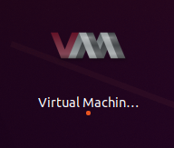

The main window for Virtual Machine Manager should open:

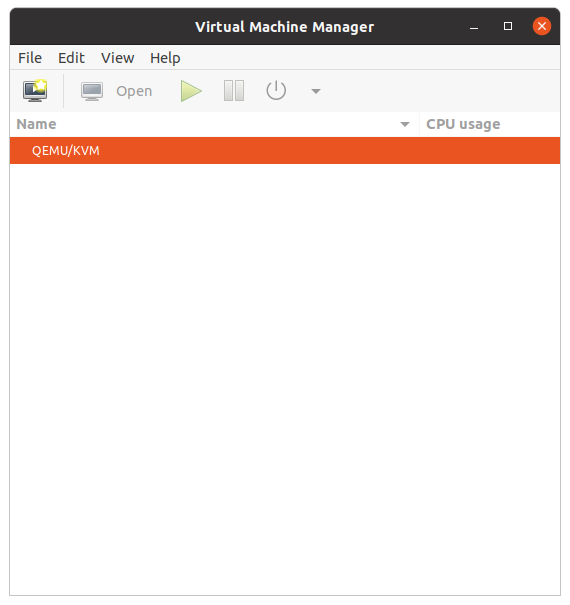

`Right-click` on "QEMU/KVM" and choose "Details":

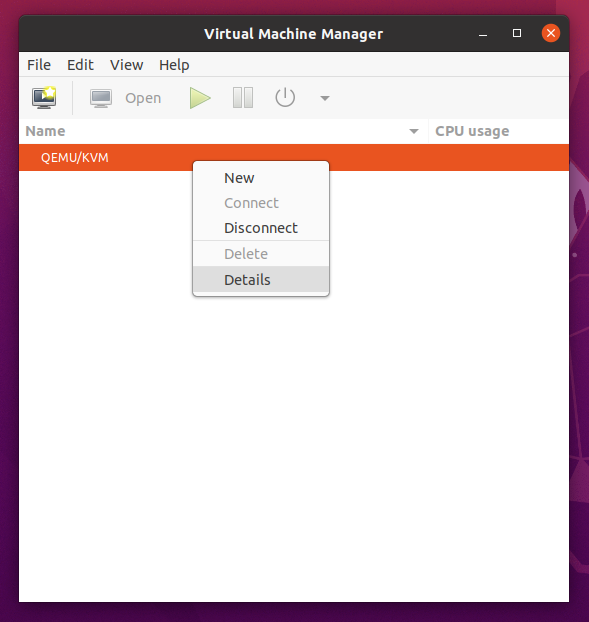

A new window will open showing you "Qemu/KVM Connection Details"

Click on "Virtual Networks" and you should see the bridge "hostbridge"

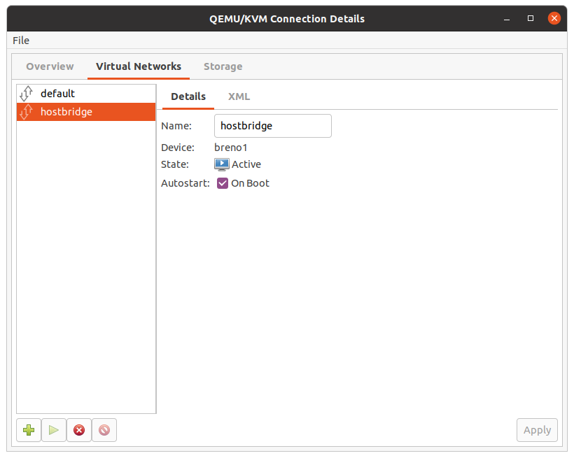

## Use Virtual Machine Manager to Create a VM

There are command line tools to create VMs such as virt-install, but Virtual Machine Manager
provides a way of doing it through a GUI.

We can now create a VM, we will use Ubuntu Desktop as a sample and thus need the ISO.

On the main Virtual Machine Manager Window, click on the "Create a new virtual machine":
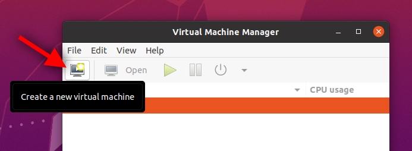

A new window will open, choose "Local install media (ISO image or CDRom)"
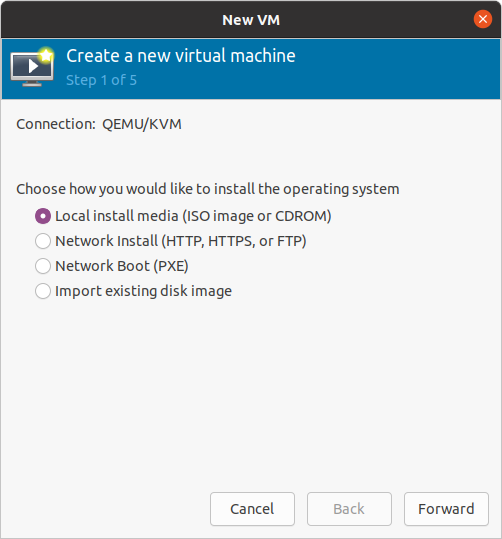

Click `Forward`, it will now let you choose the ISO by clicking on `Browse`:
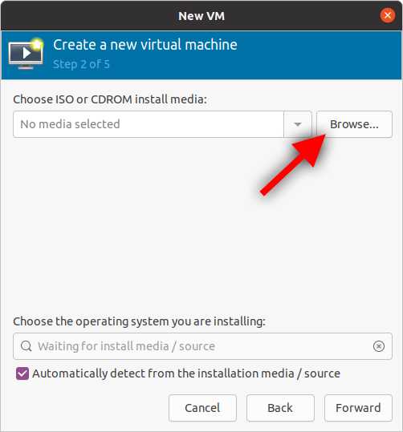

A new window will open, "Choose Storage Volume", click on `Browse Local` and
use the File chooser dialog to browse for the Ubuntu ISO.

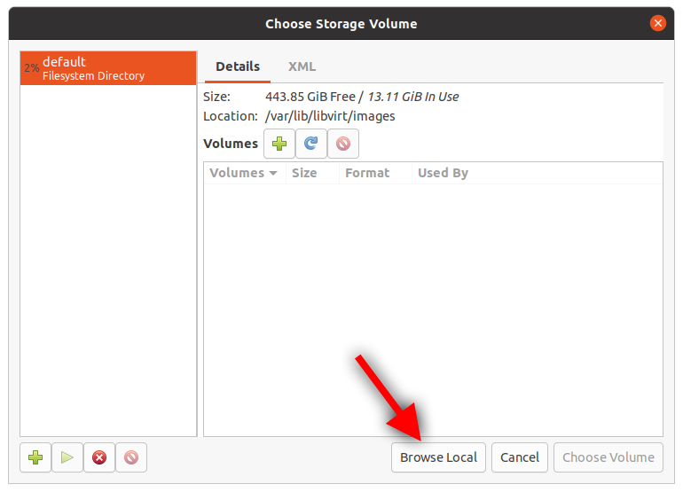

In my case I had the ISO in the `Downloads` folder

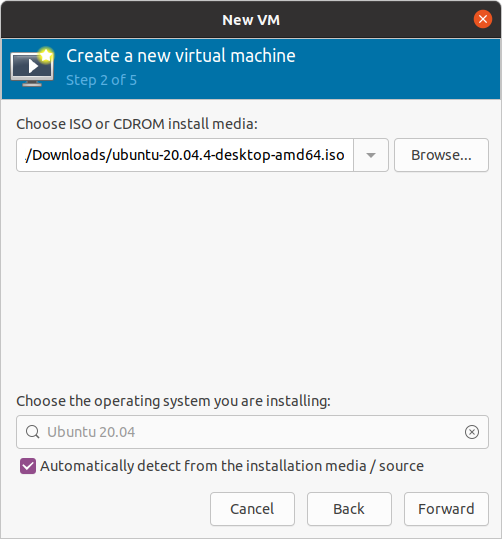

Click `Forward` which will take you to the Memory and CPU Settings.
The values used here are up to you and your particular use case,
but I would recommend a minimum of 4GB of RAM and 2 CPUs:

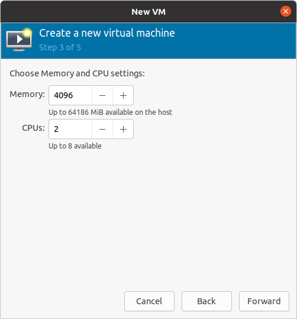

Click `Forward` which will take you to the Storage specification.
The values used here are up to you and your particular use case:

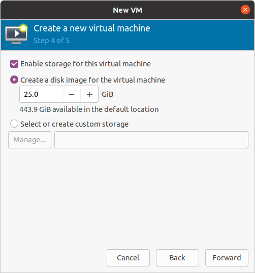

Click `Forward` which will take you to the Final configuration screen.
Here you can specify a `name` for the VM (here I chose ubuntutest), see the OS KVM thinks you are installing,
Memory, CPU, and Storage specified.  

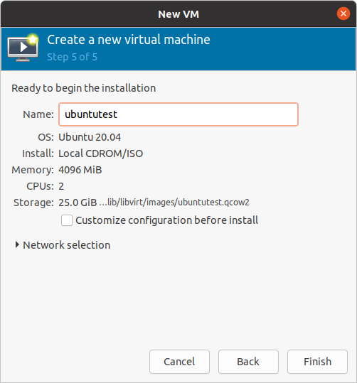

Before finishing, we want to make our new VM use the bridge network rather than
the internal NAT network. We can change this by clicking on "Network selection"
and choosing "Virtual network 'hostbridge': Bridge network":

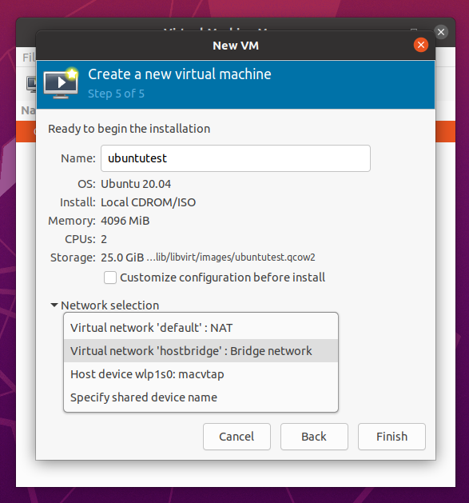

Click `Finish` and a new window called "ubuntutest on QEMU/KVM" will open. The VM will be initialized and act
just like a physical machine. In this example, the ubuntu installer will start:

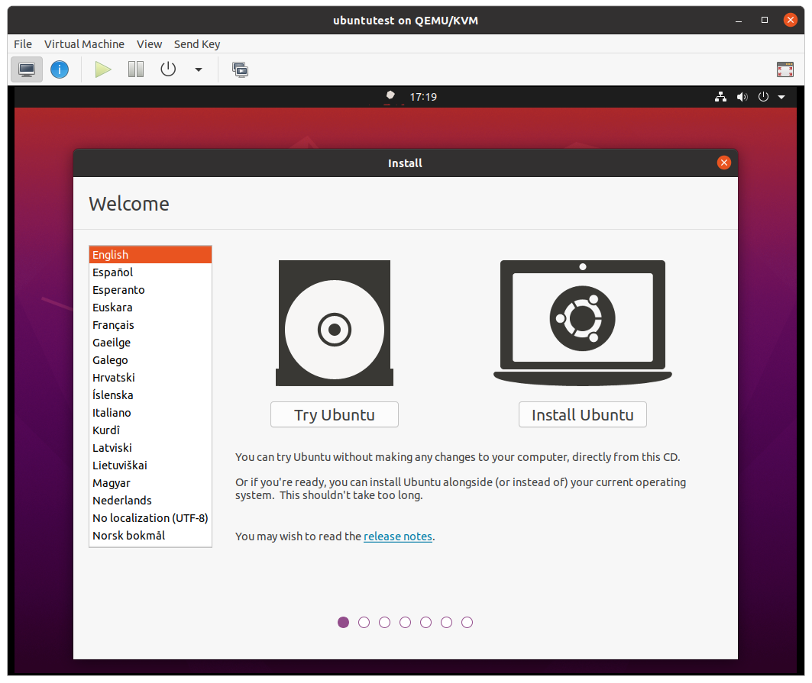

From this point forward it is pretty much equivalent to installing on
a bare metal machine. For this example, I chose "Try Ubuntu" to get a "live" session.

> Note: I opened a terminal once the "live" session started in order to verify
> that I was on the correct network.

In the screenshot below you can see that the machine has an IP of `192.168.5.190`,
meaning it reached out through the network bridge to the network and got a DHCP lease from
my local network router.  

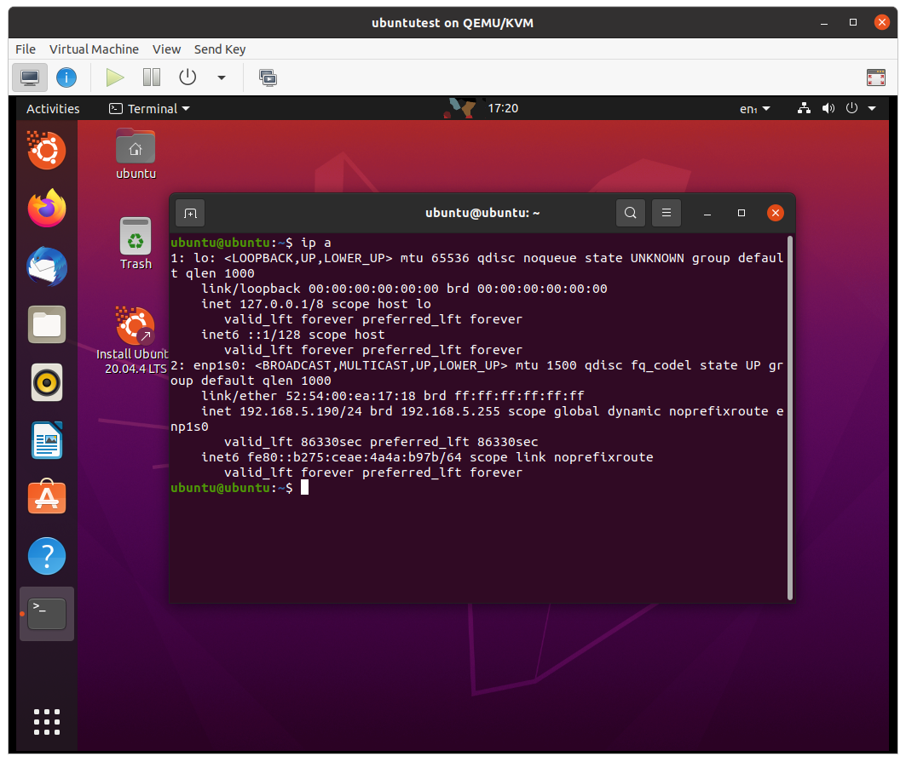

## Conclusion and Next Steps

**That's it!** You now have a machine that can host VMs.

Let me know if you have any questions. I can be reached at [@IAmDanielV](https://twitter.com/IAmDanielV) or [@iamdanielv.bsky.social](https://bsky.app/profile/iamdanielv.bsky.social).

The performance of your VMs will vary depending on the host machine resources
and number of VMs running.

## Troubleshooting

- If the bridge isn't detected, verify `netplan` syntax and reboot.
- Check `virsh net-list --all` for active networks.
- Make sure `libvirt` and `qemu-kvm` are installed.
